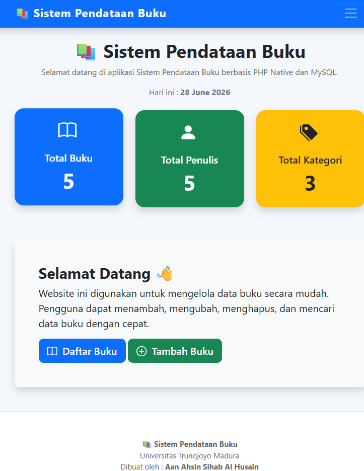
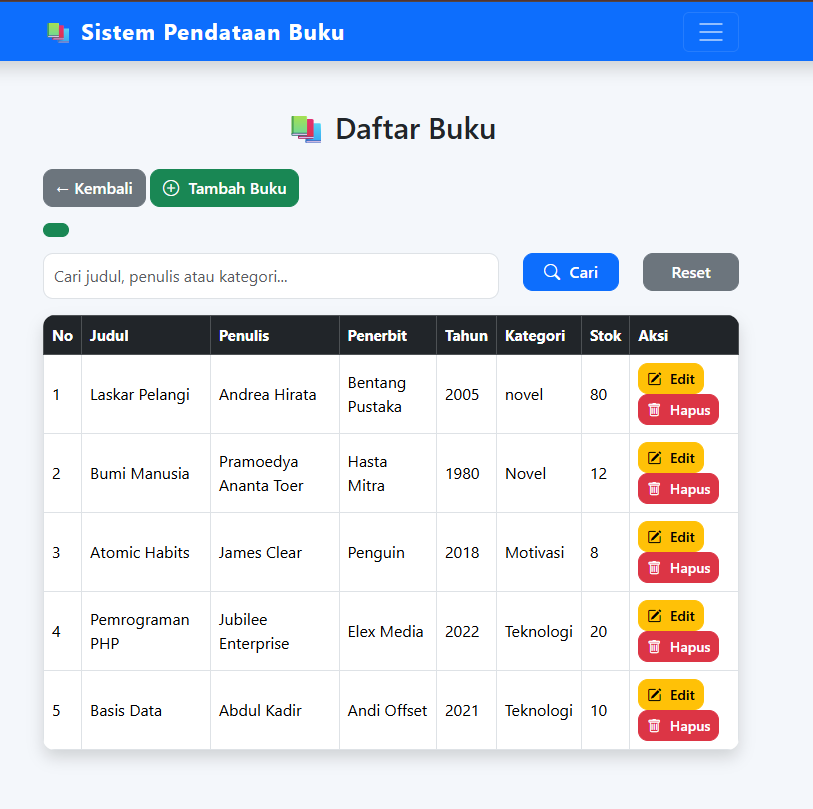
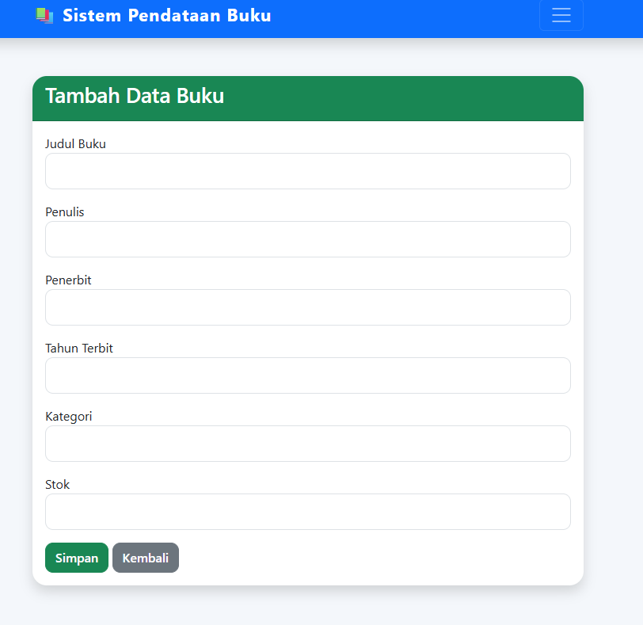
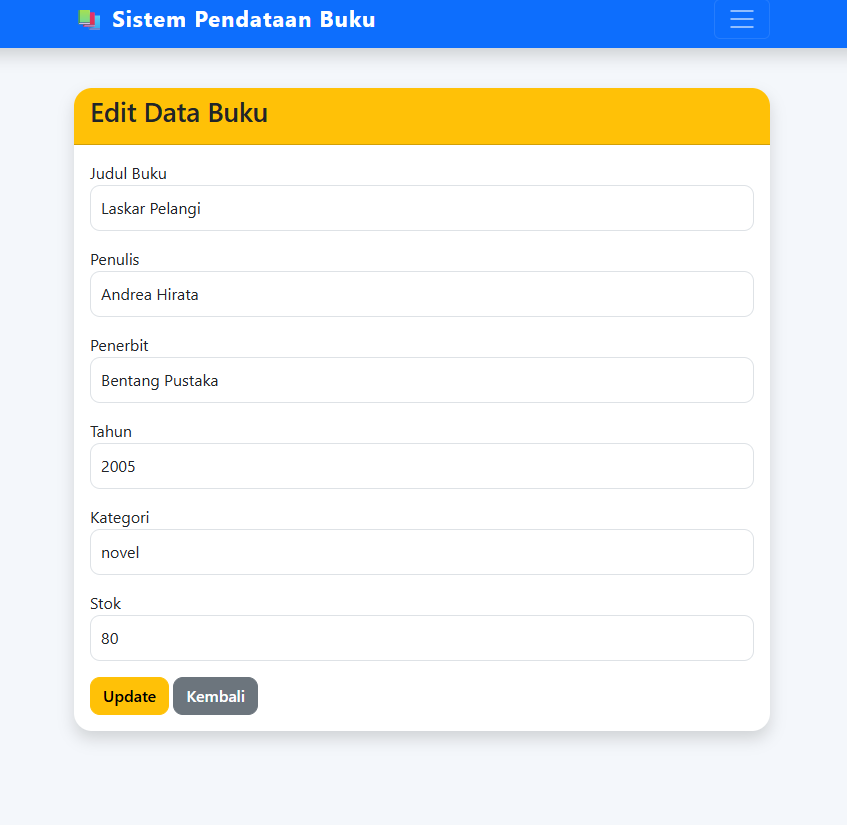

# Sistem Pendataan Buku

## Nama
Aan Ahsin Sihab Al Husain

## NIM
240631100091

## Judul Aplikasi
Sistem Pendataan Buku Berbasis Web

## Deskripsi Singkat
Aplikasi ini merupakan sistem pendataan buku berbasis web yang dibuat menggunakan PHP Native, MySQL, dan Bootstrap. Aplikasi memiliki fitur CRUD (Create, Read, Update, Delete), pencarian data buku, serta dashboard sederhana untuk membantu pengelolaan data buku.

## Screenshot Aplikasi

### Halaman Home


### Halaman Daftar Buku


### Halaman Tambah Buku


### Halaman Edit Buku


## Struktur Database

Nama Database:
```
db_perpustakaan
```

Tabel:
```
buku
```

Field:
- id_buku
- judul
- penulis
- penerbit
- tahun_terbit
- kategori
- stok

## Cara Menjalankan Aplikasi

1. Install XAMPP.
2. Jalankan Apache dan MySQL.
3. Import file `db_perpustakaan.sql` ke phpMyAdmin.
4. Simpan project di folder `htdocs`.
5. Buka browser dan akses:
   ```
   http://localhost/UAS-PWEB-240631100091/
   ```

## Teknologi yang Digunakan

- HTML5
- CSS3
- PHP Native
- MySQL
- Bootstrap 5
- Visual Studio Code
- XAMPP

## Catatan

Aplikasi ini dibuat untuk memenuhi tugas UAS Mata Kuliah Pemrograman Web.
Pengembangan aplikasi dibantu dengan AI dan telah dipahami serta disesuaikan kembali oleh penyusun.
